<div align="center">


# Neon Genesis

**A procedurally generated, real-time cyberpunk city with ray-traced shadows — built from scratch in OpenGL 3.3.**

[**Watch the demo →**](https://youtu.be/xAqpQe7Q-IM) &nbsp;·&nbsp; [**Read the report →**](report/Neon_Genesis_Report.pdf) &nbsp;·&nbsp; [Run it locally](#-build-and-run)

<a href="VIDEO_LINK_HERE">
  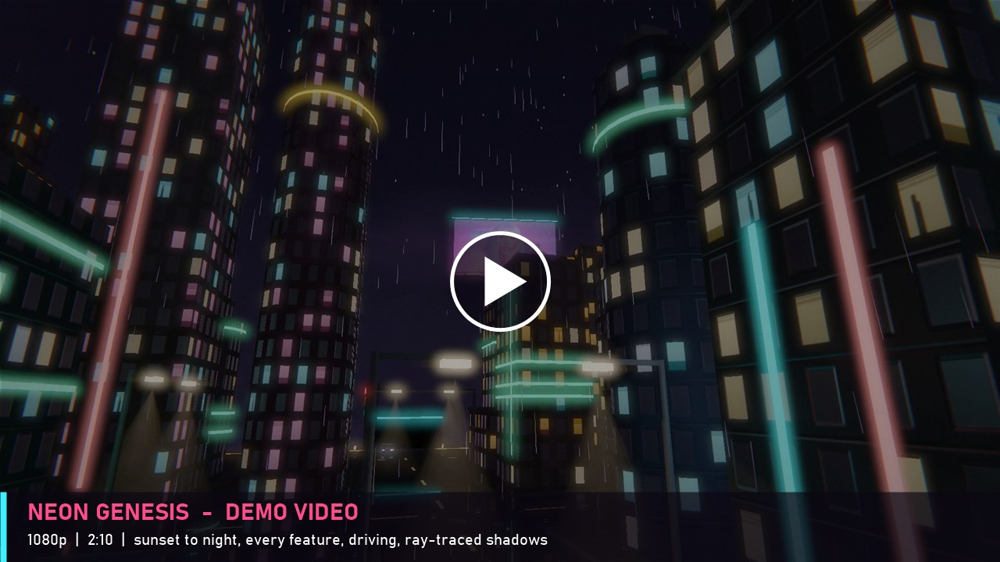
</a>

<sub>▶️ <i>Watch the demo — sunset to night over the island, every lighting and shading mode, driving through the rain, and ray-traced shadows.</i></sub>

<br><br>


</div>

---

## Overview

Neon Genesis is a rainy cyberpunk island city that you can **fly through, drive in, and watch fall from sunset into night**. Nothing is placed by hand: a seeded generator builds the whole city — 53 towers in five architectural styles, neon signs, billboards, 80 street lamps, 25 signalised junctions and distant districts across the water — so the same seed always produces the same city.

It was built for **CSE 4102: Computer Graphics and Image Processing Laboratory** at **KUET**, and covers every course topic — lighting, transformations, Gouraud and Phong shading, animation and interaction — then goes further with **hybrid ray tracing**, planar reflections, HDR bloom and a traffic simulation. It runs at **77–160 FPS on an AMD Ryzen 5 5500U with integrated Vega 7 graphics**.

<div align="center">
  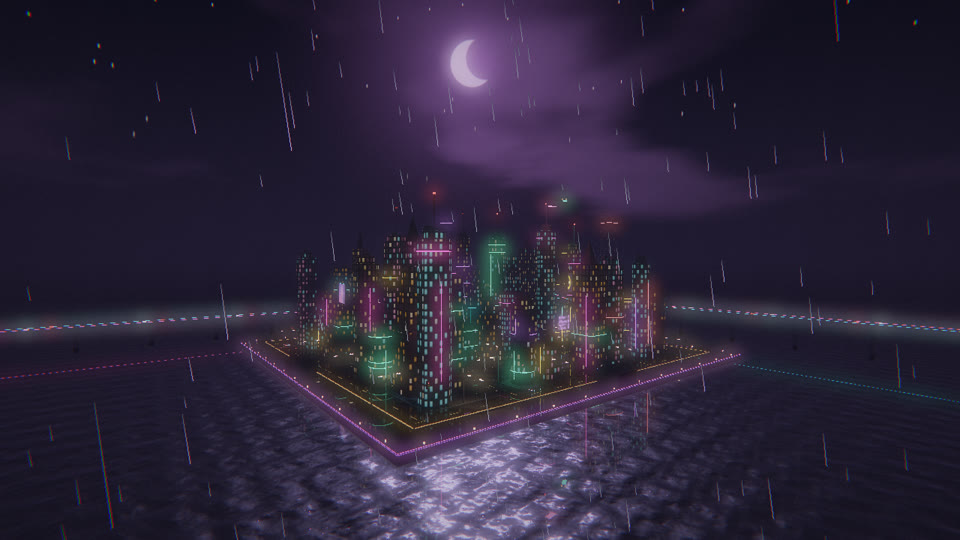
  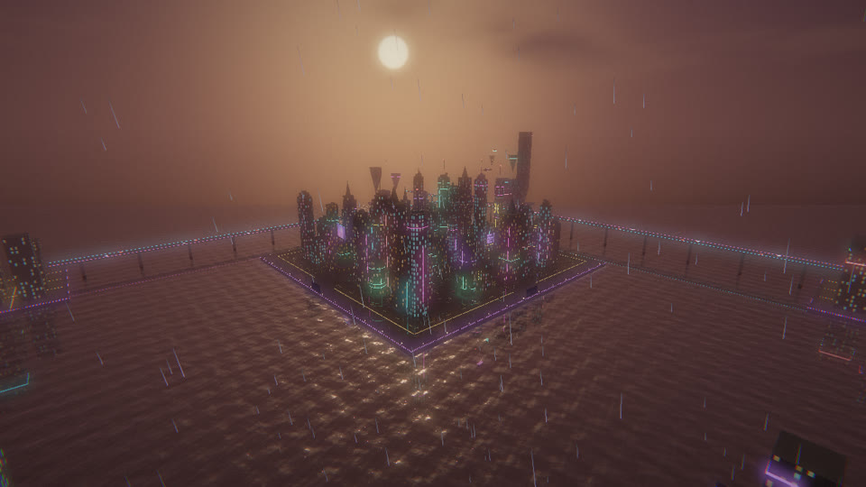
</div>

## ✨ Features

| | |
|---|---|
| 💡 **Four light types** | Ambient, directional (sun & moon), point (neon, flying cars) and spot (80 street lamps, headlights) under **Blinn–Phong**; the best 24 of 200+ lights are chosen every frame |
| 🎨 **Three shading modes** | **Flat**, **Gouraud** (per vertex) and **Phong** (per pixel), switchable live with keys 1 / 2 / 3 |
| ☀️ **Ray-traced shadows** | One shadow ray per pixel toward the sun or moon, tested against 127 building boxes through a uniform grid (slab test + 2D DDA) |
| 🌧️ **Wet streets & water** | The city mirrored under a Fresnel-blended road, puddles with rain ripples, waves with a moonlight glitter path |
| 🏙️ **Procedural city** | Seeded generator (LCG); press **N** for a brand-new city |
| 🚗 **Traffic & driving** | AI cars keep right, keep a gap and obey 15 s signal cycles; press **C** to drive with a chase camera |
| 🌆 **Dusk ↔ night** | Sky, fog, sun and moon blend over 9 s while the lamps switch on one after another |
| ✨ **Post-processing** | HDR, separable Gaussian bloom, Reinhard tone mapping, fog, lens streaks, dynamic resolution |
| 🧱 **Procedural textures** | Windows, asphalt, paving, stone and billboards are all generated in code, with mipmaps and anisotropic filtering |
| ⏸️ **Pause menu** | **ESC** shows every control on screen, with Resume and Exit |

## 🖼️ Gallery

<div align="center">

| Flat | Gouraud | Phong |
|:---:|:---:|:---:|
| 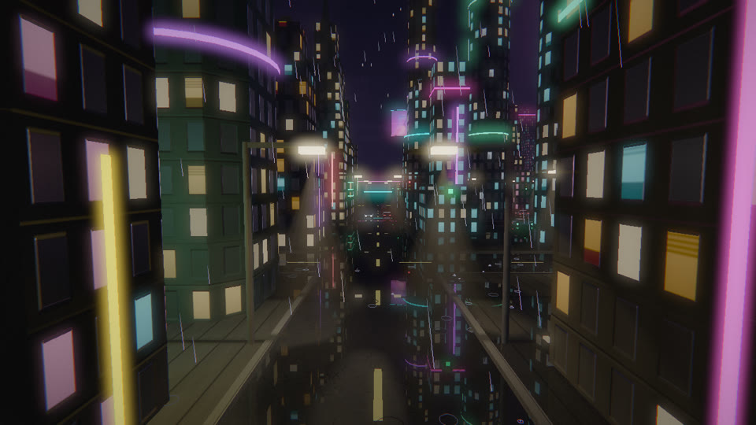 | 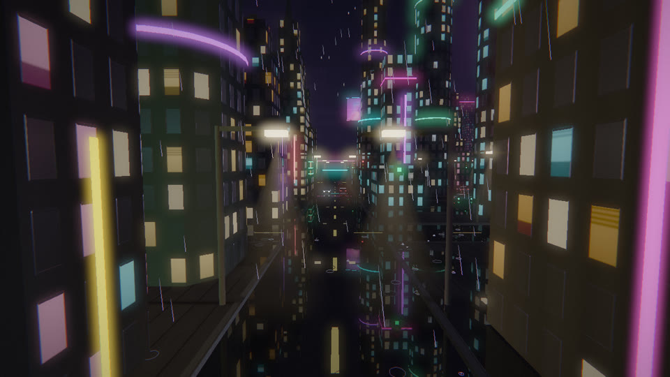 |  |

| Ray-traced shadows **on** | Ray-traced shadows **off** |
|:---:|:---:|
| 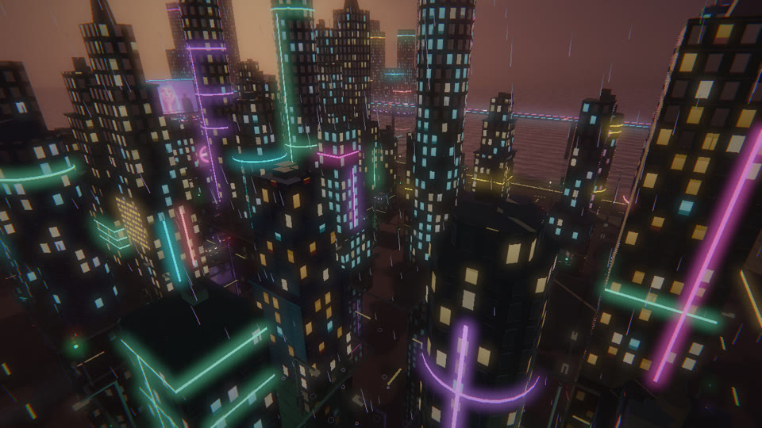 | 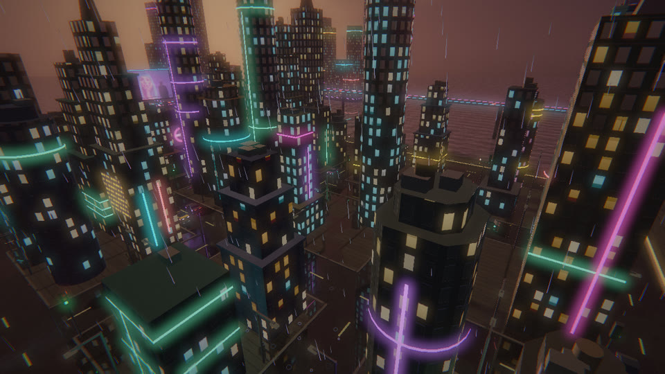 |

| Spotlights and the wet road | Driving in the rain |
|:---:|:---:|
| 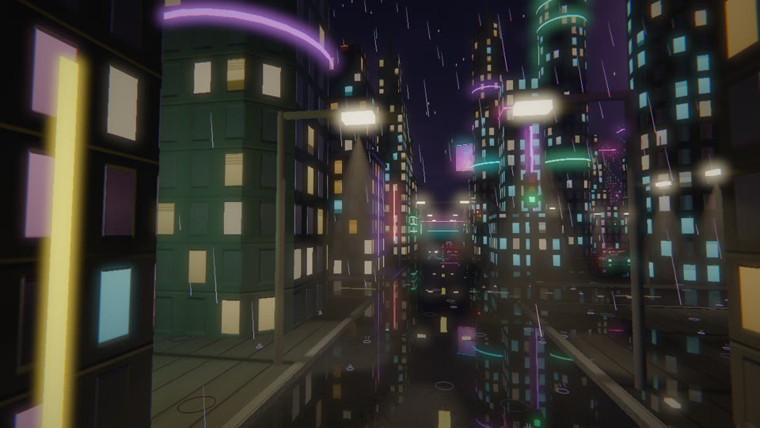 | 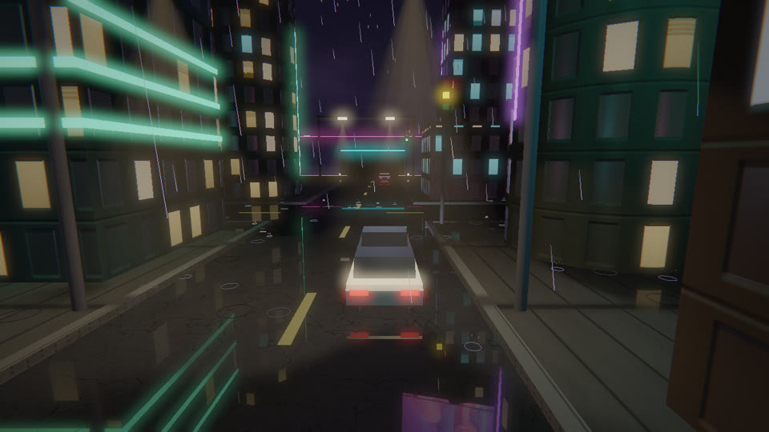 |

| Neon and image billboards | Sea wall, foam and waves |
|:---:|:---:|
| 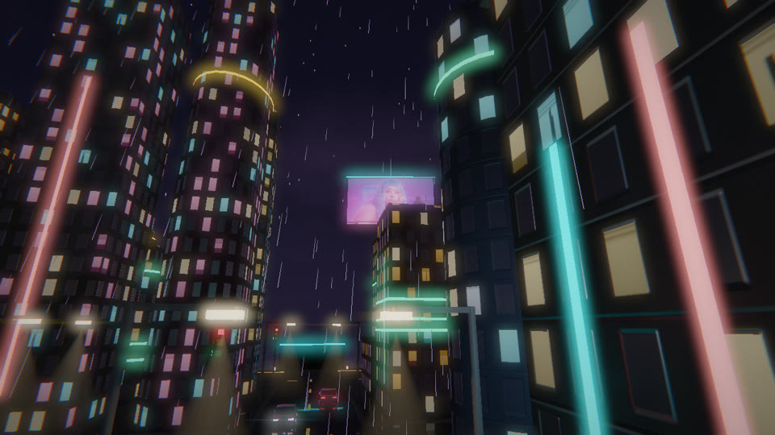 | 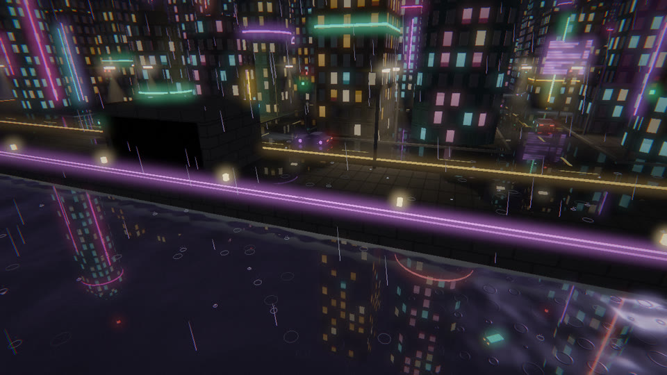 |

</div>

## 🎮 Controls

| Key | Action | Key | Action |
|---|---|---|---|
| `W A S D` + mouse | Fly / look | `1` `2` `3` | Flat / Gouraud / Phong |
| `SPACE` / `CTRL` | Up / down | `H` | Ray-traced shadows |
| `SHIFT` | Move faster | `E` | Dusk ↔ night |
| `C` | Get in / out of a car | `B` / `G` / `R` | Bloom / reflections / rain |
| `W S A D` · `SPACE` | Drive · handbrake | `X` | Detail effects |
| `V` | Camera tour | `N` | Generate a new city |
| `P` | Pause animation | `F` | Wireframe |
| `M` / `T` | Music on-off / next track | `L` | Show light positions |
| `F11` / `F12` | Fullscreen / screenshot | `ESC` | Pause menu (controls, resume, exit) |

## 🚀 Build and Run

**Requirements:** Windows 10/11 and [MSYS2](https://www.msys2.org/) with the MinGW-w64 toolchain, GLFW and GLM:

```bash
pacman -S mingw-w64-x86_64-gcc mingw-w64-x86_64-glfw mingw-w64-x86_64-glm
```

**Build and run** — double-click `build.bat`, or:

```bash
g++ -O2 src/main.cpp src/glad.c -Iinclude -o neon.exe -lglfw3 -lopengl32 -lgdi32 -lwinmm -lgdiplus
./neon.exe
```

> **Optional music:** put `.mp3` files in `assets/music/` (the songs used in the demo are not included for copyright reasons). Any picture in `assets/billboards/` appears on the rooftop screens.

## 🧠 How It Works

<details>
<summary><b>Frame pipeline</b></summary>

```
update (one clock) → choose best 24 lights → sky → mirrored city (reflection)
→ road & water (Fresnel blend) → city: Blinn–Phong + ray-traced shadows
→ rain & light beams → bloom + lens streaks → Reinhard tone mapping, gamma → screen
```
</details>

<details>
<summary><b>Key equations</b></summary>

| | |
|---|---|
| Transformation | $M = T\,R\,S,\quad p_{clip} = P\,V\,M\,p_{obj}$ |
| Normal matrix | $N_{mat} = (M_{3\times3}^{-1})^T$ |
| Blinn–Phong | $I = k_a + \sum_i C_i A_i S_i \left[\max(N\cdot L_i,0) + k_s \max(N\cdot H_i,0)^{\alpha}\right],\quad H = \frac{L+V}{\lVert L+V\rVert}$ |
| Attenuation / spot | $A = (1 - d/R)^2,\qquad S = (\cos\theta)^e$ inside the cone |
| Gouraud | $I = \lambda_1 I_1 + \lambda_2 I_2 + \lambda_3 I_3$ |
| Fresnel (Schlick) | $F = (1 - N\cdot V)^5$ |
| Ray–box (slab) | $t_{in} = \max_k \min(t_{1k}, t_{2k}),\ t_{out} = \min_k \max(t_{1k}, t_{2k})$, hit if $t_{out} \ge \max(t_{in}, 0)$ |
| Fog | $f = 1 - e^{-(d\rho)^2}$ |
| Tone mapping | $c' = \dfrac{c}{1+c}$, then gamma $c'^{\,1/2.2}$ |

</details>

<details>
<summary><b>Project structure</b></summary>

```
Neon-Genesis/
├── src/
│   ├── main.cpp       window, input, frame loop, drawing, light selection
│   ├── shaders.h      all GLSL: lighting, 3 shading modes, ray tracing, sky, bloom, tone mapping
│   ├── mesh.h         cube, cylinder, cone, pyramid, quad, extruded outlines
│   ├── city.h         procedural city generator, rain, flying vehicles
│   ├── traffic.h      AI traffic, signals, the drivable car
│   ├── textures.h     procedural textures
│   ├── raytrace.h     building boxes for the shadow rays
│   ├── render.h       framebuffers, bloom, shader compiling
│   ├── menu.h         pause menu
│   ├── images.h       PNG/JPG loading (GDI+)
│   └── music.h        background music (Windows MCI)
├── include/           GLAD and KHR headers
├── assets/            logo, billboard picture, README images
├── report/            LaTeX report, figures and presentation
├── build.bat
└── proposal.md
```
</details>

## 📄 Report and Presentation

- **Project report** — [`report/Neon_Genesis_Report.pdf`](report/Neon_Genesis_Report.pdf) (LaTeX source: [`report/neon_genesis_report.tex`](report/neon_genesis_report.tex)): proposed vs implemented features, methodology with every equation, results and performance measurements.
- **Presentation** — [`report/presentation/Neon_Genesis_Presentation.pptx`](report/presentation/Neon_Genesis_Presentation.pptx)
- **Original proposal** — [`proposal.md`](proposal.md)

## 📚 References

Phong (1975) and Blinn (1977) lighting · Gouraud shading (1971) · Whitted ray tracing (1980) · Kay & Kajiya slab test (1986) · Amanatides & Woo grid traversal (1987) · Schlick's Fresnel approximation (1994) · Reinhard tone mapping (2002) · Catmull–Rom splines (1974) · Parish & Müller, *Procedural Modeling of Cities* (2001) · [LearnOpenGL](https://learnopengl.com/) by Joey de Vries. Full list in the report.

Built with [GLFW](https://www.glfw.org/), [GLAD](https://glad.dav1d.de/) and [GLM](https://github.com/g-truc/glm).

---

<div align="center">

**Dewan Salman Rahman Zisan** · Roll 2107015
Department of Computer Science and Engineering · Khulna University of Engineering & Technology

<sub>Course teachers: Md Tajmilur Rahman and Md. Mubtashim Abrar Nihal, Lecturers</sub>

</div>
